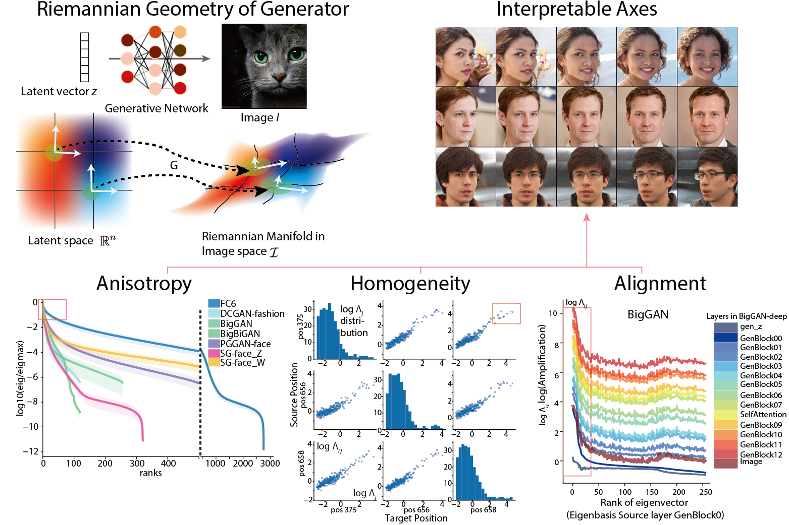

# "A Geometric Analysis of Deep Generative Image Models and Its Applications" Official Code 
 
This repo provides generic toolkits for **analyzing the latent geometry of generative models**, and using the goemetric information to improve on various applications like GAN interpretability, inversion, optimization in latent space. 

Specifically, it can compute the Riemannian metric tensor of the latent space of the generator, pulling back certain image distance function (e.g. LPIPS). Then the eigen structure of the metric tensor will yield useful information about the interpretable axes (usually in the top eigen space), and efficient ways to explore in the latent space.  

A work published in ICLR 2021. 

* [Open Review](https://openreview.net/forum?id=GH7QRzUDdXG)
* [Arxiv](https://arxiv.org/abs/2101.06006)



## Basic Usage

```python
import lpips
import numpy as np
from core.GAN_utils import BigGAN_wrapper, loadBigGAN
from core import hessian_compute
from core.hessian_axis_visualize import vis_eigen_action, vis_eigen_explore, vis_distance_curve
# Define a image distance metric
ImDist = lpips.LPIPS(net="squeeze", )
# Define and wrap up a generator
BGAN = loadBigGAN()  # Default to be "biggan-deep-256" in `pytorch-pretrained-BigGAN`
BGAN.cuda().eval()
BGAN.requires_grad_(False)
G = BigGAN_wrapper(BGAN)
feat = G.sample_vector(device="cuda", class_id=145) # class King Penguin
# Compute the local Riemannian metric
eigval, eigvec, H = hessian_compute(G, feat, ImDist, hessian_method="BackwardIter", cutoff=20)
# Visualize the axes
refvect = feat.cpu().numpy()
montage, _,  = vis_eigen_explore(refvect, eigvec, eigval, G, eiglist=[1,2,4,8,16], transpose=False,
                                maxdist=0.5, rown=7, sphere=False, save=False)
distmat, _, _ = vis_distance_curve(refvect, eigvec, eigval, G, ImDist, eiglist=[1,2,4,8,16],
                                    maxdist=0.5, rown=5, sphere=False, distrown=15)
# Visualize the axes applied to other reference images.  
ref_codes = np.random.randn(5, 128)
montage2, _ = vis_eigen_action(eigvec, ref_codes, G, transpose=False, 
                                maxdist=0.5, rown=7, sphere=False, save=False)
```
More examples in our tutorial notebooks, which walk you through a toy version of our figures.  

## How It Works?
The metric tensor `H` of the image manifold defined by generator `G` is the Hessian of the squared distance function `d^2` on it. In our case the squared distance function is L2 or LPIPS distance. 


So the work comes down to computing Hessian or finding its low rank approximation (i.e. top eigenvalue and eigenvectors). Direct method is to create computational graph towards gradient (see [Doc](https://pytorch.org/docs/stable/autograd.html#torch.autograd.grad)), and then perform 2nd order backpropagation for each entry of the gradient to get the hessian (see [`get_full_hessian`](core/GAN_hvp_operator.py)). 

A way to compute the low rank approximation of Hessian matrix is to apply the Lanczos iteration eigen solver on the Hessian as a linear operator (i.e. hessian vector product (HVP) operator). In this manner, we will obtain the top eigen pairs without constructing the whole Hessian matrix. The Hessian vector product could be computed with backward auto differentiation, or forward finite differencing. 


See [GAN_hvp_operator](core/GAN_hvp_operator.py) for more info. 

## Structure of Repo
`core` contains code for analyzing computed Hessian information and generate figure and statistics from it. 
* `GAN_hessian_compute` implement the core API for compute metric tensor given a generator and a distance metric. It depends on 
    * `GAN_hvp_operator` implement the Hessian Vector Product operator based on auto-differentiation and finite differencing.  
    * `lanczos_generalized` link the HVP operator to the ARPACK eigenvalue solver in `scipy`.
* `GAN_utils` provides loader and wrapper of pretrained generators. You may add more to it for your custom GAN. 
* `hessian_analysis_tools` provides handy functions to analyze and visualize the geometry after computing the metric tensors.
* `hessian_axis_visualize` provides functions to visualize the image transformations that the axes represents  

## Key Dependency

* `pytorch` (we have tested 1.3.1 and 1.5.0)
* `scipy` 
* `CUDA` (we have tested 10.1)
* [`hessian-eigenthings`](https://github.com/noahgolmant/pytorch-hessian-eigenthings). Use this 
`pip install --upgrade git+https://github.com/noahgolmant/pytorch-hessian-eigenthings.git@master#egg=hessian-eigenthings`
* [`LPIPS`](https://github.com/richzhang/PerceptualSimilarity), `pip install lpips`

Code has been developed and tested on a GTX 1060 GPU (6GB). 

### Obtain pre-trained GANs
Our algorithm is a generic analysis that could be applied to generative models. To repreoduce the results in the paper, you need to obtain some pre-trained GANs. 

* [DCGAN](https://pytorch.org/hub/facebookresearch_pytorch-gan-zoo_dcgan/) from pytorch GAN zoo. Trained on 64 by 64 pixel fashion dataset. It has a 120d latent space, using Gaussian as latent space distribution. 
* [Progressive Growing GAN (PGGAN)](https://pytorch.org/hub/facebookresearch_pytorch-gan-zoo_pgan/) from pytorch GAN zoo. We use the 256 pixel version. It's trained on celebrity faces dataset (CelebA). It has a 512d latent space, using Gaussian as latent space distribution. 
* [DeePSim/FC6GAN](https://lmb.informatik.uni-freiburg.de/people/dosovits/code.html). This model is based on DCGAN architechture. We translated it into pytorch, included the model definition in the script and hosted the weights. 
* [BigGAN](https://github.com/huggingface/pytorch-pretrained-BigGAN). From HuggingFace. We used 256 pix version in the paper, with 128d noise vector input and 128d class embedding input. 
* [BigBiGAN](https://tfhub.dev/deepmind/bigbigan-resnet50/1). Weights obtained from DeepMind official tf version. The generator could be translated into pytorch. We used bigbigan-resnet50 version, with 120d latent space and 128 pix output.  
* [StyleGAN](https://github.com/rosinality/style-based-gan-pytorch). We used 256 pix version, with 512d Z and W latent space. 
* [StyleGAN2](https://github.com/rosinality/stylegan2-pytorch). We translated the weights of pretrained models from [this list](https://pythonawesome.com/a-collection-of-pre-trained-stylegan-2-models-to-download), to pytorch. All with 512d Z and W latent space, with various spatial resolution. 
* [WaveGAN](https://github.com/mostafaelaraby/wavegan-pytorch/). An audio generating GAN. We trained it ourselves using piano dataset. 

To analyze your own GAN, follow this tutorial to come [Tutorial_Custom_Metric_and_GANs](Tutorial_Custom_Metric_and_GANs.ipynb)

