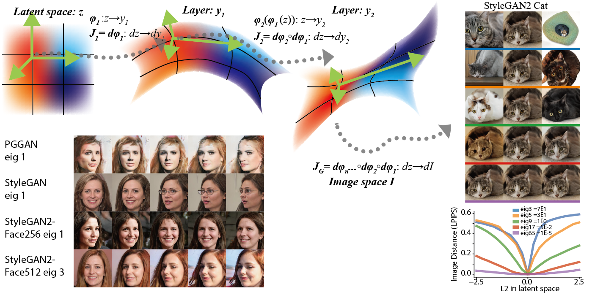

# "A Geometric Analysis of Deep Generative Image Models and Its Applications" Official Code 
 
This repo curate generic toolkits for **analyzing the latent geometry of generative models**, and using the goemetric information to improve on various applications like GAN interpretability, inversion, optimization in latent space. 

Specifically, it can compute the Riemannian metric tensor of the latent space of the generator, pulling back certain image distance function (e.g. LPIPS). Then the eigen structure of the metric tensor will yield useful information about the interpretable axes (usually in top eigen space), and efficient ways to explore in the latent space.  

A work published in ICLR 2021. 

* [Open Review](https://openreview.net/forum?id=GH7QRzUDdXG)
* [Arxiv](https://arxiv.org/abs/2101.06006)



## Basic Usage
```python
import lpips
from core.GAN_utils import BigGAN_wrapper, loadBigGAN
from core import hessian_compute
from core.hessian_axis_visualize import vis_eigen_action, vis_eigen_explore
# Define a image distance metric
ImDist = lpips.LPIPS(net="squeeze", )
# Define and wrap up a generator
BGAN = loadBigGAN()  # Default to be "biggan-deep-256" in `pytorch-pretrained-BigGAN`
BGAN.cuda().eval()
BGAN.requires_grad_(False)
G = BigGAN_wrapper(BGAN)
feat = G.sample_vector(device="cuda", class_id=145) # class King Penguin
# Compute the local Riemannian metric
eva_FI, evc_FI, H_FI = hessian_compute(G, feat, ImDist, hessian_method="BackwardIter", cutoff=20)
# Visualize the axes
refvect = feat.cpu().numpy()
mtg, codes_all,  = vis_eigen_explore(refvect, evc_FI, eva_FI, G, eiglist=[1,2,4,8,16], transpose=False,
                                        maxdist=0.5, rown=7, sphere=False, save=False)
# Visualize the axes applied to other reference images.  
```


## Structure of Repo
`analysis` contains code for analyzing computed Hessian information and generate figure and statistics from it. 

## Key Dependency

* pytorch (we have tested 1.3.1 and 1.5.0)
* CUDA (we have tested 10.1)
* scipy
* [`hessian-eigenthings`](https://github.com/noahgolmant/pytorch-hessian-eigenthings). Use this 
`pip install --upgrade git+https://github.com/noahgolmant/pytorch-hessian-eigenthings.git@master#egg=hessian-eigenthings`
* [LPIPS](https://github.com/richzhang/PerceptualSimilarity), `pip install lpips`

Code has been developed and tested on a GTX 1060 GPU (6GB). 

### Obtain pre-trained GANs
Our algorithm is a generic analysis that could be applied to generative models. To repreoduce the results in the paper, you need to obtain some pre-trained GANs. 

* [DCGAN](https://pytorch.org/hub/facebookresearch_pytorch-gan-zoo_dcgan/) from pytorch GAN zoo. Trained on 64 by 64 pixel fashion dataset. It has a 120d latent space, using Gaussian as latent space distribution. 
* [Progressive Growing GAN (PGGAN)](https://pytorch.org/hub/facebookresearch_pytorch-gan-zoo_pgan/) from pytorch GAN zoo. We use the 256 pixel version. It's trained on celebrity faces dataset (CelebA). It has a 512d latent space, using Gaussian as latent space distribution. 
* [DeePSim/FC6GAN](https://lmb.informatik.uni-freiburg.de/people/dosovits/code.html). This model is based on DCGAN architechture. We translated it into pytorch, included the model definition in the script and hosted the weights. 
* [BigGAN](https://github.com/huggingface/pytorch-pretrained-BigGAN). From HuggingFace. We used 256 pix version in the paper, with 128d noise vector input and 128d class embedding input. 
* [BigBiGAN](https://tfhub.dev/deepmind/bigbigan-resnet50/1). Weights obtained from Deepmind official tf version. The generator could be translated into pytorch. We used bigbigan-resnet50 version, with 120d latent space and 128 pix output.  
* [StyleGAN](https://github.com/rosinality/style-based-gan-pytorch). We used 256 pix version, with 512d Z and W latent space. 
* [StyleGAN2](https://github.com/rosinality/stylegan2-pytorch). We translated the weights of pretrained models from [this list](https://pythonawesome.com/a-collection-of-pre-trained-stylegan-2-models-to-download), to pytorch. All with 512d Z and W latent space, with various spatial resolution. 
* [WaveGAN](https://github.com/mostafaelaraby/wavegan-pytorch/). An audio generating GAN. We trained it ourselves using piano dataset. 

To analyze your own GAN, follow this tutorial to come [Tutorial_Custom_Metric_and_GANs](Tutorial_Custom_Metric_and_GANs.ipynb)

## Efficiency of Analysis